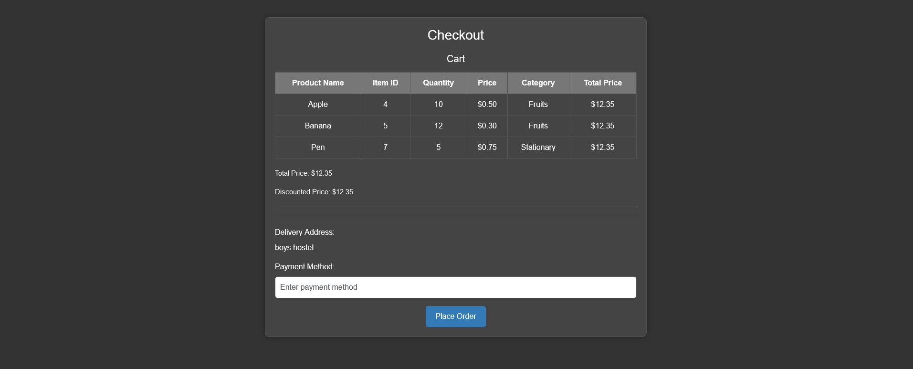

# Grocery Store Website

We have developed an E-commerce application designed to simulate a real-life online shopping platform where users, sellers, and administrators can interact seamlessly. Our aim was to create a functional and user-friendly website that closely mirrors the operations of an actual E-commerce site.

## Admin Functionalities


- **Admin Management:**
  - Register and login with username and password credentials.
  - Access a dashboard for viewing orders and sales data.
  - Manage delivery boys by adding new entries.
  - Create and manage promotional offers with discount codes.

## User Functionalities



- **User Management:**
  - Register and login using email and password.
  - Browse products and add them to the cart.
  - View and adjust cart contents, including adding, removing, and updating quantities.
  - Apply promotional offers to the cart for discounts.
  - Proceed to checkout with delivery address confirmation.

## Seller Functionalities


- **Seller Management:**
  - Login with a phone number for authentication.
  - Add new products with details such as name, description, category, price, and quantity.
  - Remove existing products from inventory.
  - Manage product categories by adding or removing them.

## General Functionalities

- **Database Operations:**
  - Perform CRUD operations using Django ORM for models like Admin, Order, DeliveryBoy, Offers, Category, Item, Vendor, Customer, Cart, and CartItem.
  - Implement error handling for validation checks and feedback messages to users.
  - Manage user sessions to track cart items and discounts during checkout.


## Installation and Setup

Follow these steps to set up and run the E-commerce website on your local machine:

1. **Clone the Repository:**
   ```sh
   git clone https://github.com/Aaryakhandelwal/Grocery-Store-Website.git

2. **Set Up a Virtual Environment:**
   ```sh
   cd Grocery-Store-Website
    python -m venv venv
    source venv/bin/activate   # On Windows use `venv\Scripts\activate`
3. **Apply Migrations:**
   ```sh
   python manage.py makemigrations
    python manage.py migrate
4. **Run the Development Server:**
   ```sh
   python manage.py runserver
Now you can access the website by clicking on the link avalaible.


## Technologies Used

This project leverages modern technologies such as **HTML, CSS, JavaScript and Django** to deliver a robust and scalable online grocery shopping experience.
